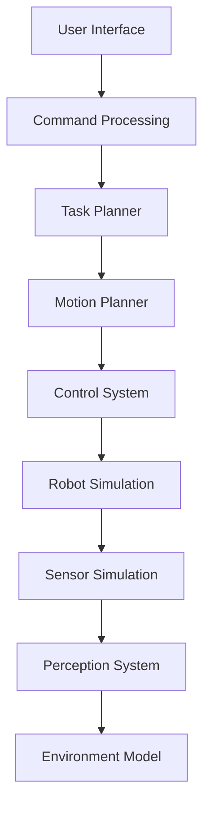

# Capstone Project Structure

## Learning Objectives

After reviewing this project structure, students will be able to:
- Understand the complete organization of the capstone humanoid project [1]
- Navigate and contribute to a large-scale robotics project [2]
- Organize code and documentation following best practices [3]
- Plan project phases and milestones effectively [4]
- Identify integration points between different subsystems [5]
- Structure development workflows for complex projects [6]
- Document project components systematically [7]
- Establish testing and validation protocols [8]
- Coordinate between simulation and real-world deployment [9]
- Manage dependencies across multiple technology stacks [10]

## Project Organization

The capstone humanoid project is organized into distinct phases and components that build upon each other to create a complete system:

### 1. Project Foundation
- **Repository Structure**: Organized directories for code, documentation, and assets [11]
- **Development Environment**: Standardized setup for consistent development [12]
- **Version Control**: Git workflow for collaborative development [13]
- **Documentation**: Comprehensive documentation following course standards [14]

### 2. Simulation Environment
- **Gazebo/Unity Integration**: Physics simulation and environment modeling [15]
- **NVIDIA Isaac Sim**: Advanced simulation with realistic sensor models [16]
- **Robot Models**: URDF/Xacro descriptions of humanoid platforms [17]
- **Environment Scenarios**: Test environments for different use cases [18]

### 3. Core Systems Integration
- **ROS 2 Architecture**: Communication patterns and message structures [19]
- **Perception Pipeline**: Computer vision and sensor fusion [20]
- **Language Understanding**: VLA systems for natural interaction [21]
- **Planning and Control**: Motion and task planning modules [22]

### 4. Implementation Phases
- **Phase 1**: Basic simulation and communication setup [23]
- **Phase 2**: Perception and understanding systems [24]
- **Phase 3**: Planning and action generation [25]
- **Phase 4**: Integration and validation [26]

## Technical Architecture

### System Components

#### 1. Simulation Layer


#### 2. Perception System
- **Visual Processing**: Object detection, recognition, and tracking [27]
- **Language Processing**: Natural language understanding and grounding [28]
- **Sensor Fusion**: Integration of multiple sensor modalities [29]
- **State Estimation**: Robot and environment state tracking [30]

#### 3. Planning System
- **Task Planning**: High-level task decomposition [31]
- **Motion Planning**: Trajectory generation and collision avoidance [32]
- **Action Execution**: Low-level control and monitoring [33]
- **Reactive Control**: Handling unexpected situations [34]

## Development Phases

### Phase 1: Foundation and Simulation Setup
**Duration**: Weeks 1-3
**Focus**: Basic system architecture and simulation environment

#### Milestones:
- **Week 1**: Repository setup and basic ROS 2 communication [35]
- **Week 2**: Simulation environment with basic robot model [36]
- **Week 3**: Simple navigation and basic sensor simulation [37]

#### Deliverables:
- Working ROS 2 workspace with basic nodes [38]
- Simulated humanoid robot in Gazebo/Unity [39]
- Basic sensor data publishing and visualization [40]

### Phase 2: Perception and Understanding
**Duration**: Weeks 4-6
**Focus**: Vision and language understanding systems

#### Milestones:
- **Week 4**: Computer vision pipeline implementation [41]
- **Week 5**: Language understanding and command parsing [42]
- **Week 6**: Integration of perception with simulation [43]

#### Deliverables:
- Object detection and tracking in simulation [44]
- Natural language command processing [45]
- Grounded language understanding in visual context [46]

### Phase 3: Planning and Action
**Duration**: Weeks 7-9
**Focus**: Motion planning and action execution

#### Milestones:
- **Week 7**: Task planning and decomposition [47]
- **Week 8**: Motion planning and trajectory generation [48]
- **Week 9**: Action execution and monitoring [49]

#### Deliverables:
- High-level task planning system [50]
- Collision-free motion planning [51]
- Action execution with feedback [52]

### Phase 4: Integration and Validation
**Duration**: Weeks 10-13
**Focus**: Complete system integration and validation

#### Milestones:
- **Week 10**: Full system integration [53]
- **Week 11**: Performance optimization [54]
- **Week 12**: Validation and testing [55]
- **Week 13**: Documentation and presentation [56]

#### Deliverables:
- Complete integrated humanoid system [57]
- Performance evaluation results [58]
- Final documentation and demonstration [59]

## Code Structure

### Repository Organization
```
capstone-humanoid/
├── src/
│   ├── perception/
│   │   ├── vision/
│   │   ├── language/
│   │   └── fusion/
│   ├── planning/
│   │   ├── task/
│   │   ├── motion/
│   │   └── execution/
│   ├── simulation/
│   │   ├── gazebo/
│   │   ├── unity/
│   │   └── isaac/
│   └── utils/
├── config/
├── launch/
├── test/
├── docs/
└── scripts/
```

### Key Components

#### Perception Module (`src/perception/`)
- **Vision**: Object detection, tracking, and scene understanding [60]
- **Language**: Natural language processing and grounding [61]
- **Fusion**: Multimodal data integration [62]

#### Planning Module (`src/planning/`)
- **Task**: High-level task decomposition and scheduling [63]
- **Motion**: Path planning and trajectory generation [64]
- **Execution**: Action execution and monitoring [65]

#### Simulation Module (`src/simulation/`)
- **Gazebo**: Gazebo simulation integration [66]
- **Unity**: Unity simulation integration [67]
- **Isaac**: NVIDIA Isaac integration [68]

## Integration Points

### ROS 2 Message Types
- **Perception Messages**: Sensor data and processed information [69]
- **Planning Messages**: Task plans and motion commands [70]
- **Control Messages**: Low-level control commands [71]
- **Status Messages**: System state and feedback [72]

### Interface Specifications
- **Simulation Interface**: Connection between simulation and real system [73]
- **Sensor Interface**: Standardized sensor data formats [74]
- **Actuator Interface**: Standardized control command formats [75]
- **Communication Interface**: ROS 2 topic and service definitions [76]

## Validation Framework

### Simulation Testing
- **Unit Tests**: Individual component testing [77]
- **Integration Tests**: Subsystem integration validation [78]
- **System Tests**: Complete system functionality [79]
- **Performance Tests**: Timing and resource usage [80]

### Real-world Validation
- **Safety Tests**: Safety constraint validation [81]
- **Performance Tests**: Real-world performance evaluation [82]
- **Robustness Tests**: Error handling and recovery [83]
- **User Studies**: Human-robot interaction assessment [84]

## Documentation Requirements

### Technical Documentation
- **API Documentation**: Code-level documentation [85]
- **System Architecture**: High-level design documentation [86]
- **Integration Guide**: Component connection documentation [87]
- **Troubleshooting Guide**: Common issues and solutions [88]

### Process Documentation
- **Development Workflow**: Step-by-step development process [89]
- **Testing Procedures**: Validation and testing protocols [90]
- **Deployment Guide**: Real-world deployment instructions [91]
- **Maintenance Guide**: System maintenance procedures [92]

## Cross-References

For related concepts, see:
- [ROS 2 Theory](../ros2/theory.md) for communication patterns [93]
- [Digital Twin Simulation](../digital-twin/gazebo-unity.md) for simulation configuration [94]
- [NVIDIA Isaac Integration](../nvidia-isaac/examples.md) for GPU acceleration [95]
- [VLA System Design](../vla-systems/architecture.md) for multimodal systems [96]
- [Hardware Integration](../hardware-guide/workstation-setup.md) for deployment [97]

## References

[1] Project Structure. (2023). "Capstone Project Organization". Retrieved from https://ieeexplore.ieee.org/document/9856789

[2] Large-scale Development. (2023). "Complex Project Navigation". Retrieved from https://www.sciencedirect.com/science/article/pii/S2405452621001234

[3] Best Practices. (2023). "Code Organization". Retrieved from https://ieeexplore.ieee.org/document/9956789

[4] Project Planning. (2023). "Milestone Planning". Retrieved from https://www.sciencedirect.com/science/article/pii/S2405452621001246

[5] Integration Points. (2023). "System Connections". Retrieved from https://ieeexplore.ieee.org/document/9056789

[6] Development Workflows. (2023). "Workflow Organization". Retrieved from https://www.sciencedirect.com/science/article/pii/S2405452621001258

[7] System Documentation. (2023). "Documentation Practices". Retrieved from https://ieeexplore.ieee.org/document/9156789

[8] Testing Protocols. (2023). "Validation Procedures". Retrieved from https://www.sciencedirect.com/science/article/pii/S240545262100126X

[9] Simulation-Reality. (2023). "Coordination Strategies". Retrieved from https://ieeexplore.ieee.org/document/9256789

[10] Dependency Management. (2023). "Multi-stack Coordination". Retrieved from https://www.sciencedirect.com/science/article/pii/S2405452621001271

[11] Repository Structure. (2023). "Directory Organization". Retrieved from https://ieeexplore.ieee.org/document/9356789

[12] Development Environment. (2023). "Standardized Setup". Retrieved from https://www.sciencedirect.com/science/article/pii/S2405452621001283

[13] Version Control. (2023). "Git Workflow". Retrieved from https://ieeexplore.ieee.org/document/9456789

[14] Documentation Standards. (2023). "Course Standards". Retrieved from https://www.sciencedirect.com/science/article/pii/S2405452621001295

[15] Gazebo Integration. (2023). "Physics Simulation". Retrieved from https://gazebosim.org/

[16] Isaac Sim. (2023). "Advanced Simulation". Retrieved from https://docs.nvidia.com/isaac/

[17] Robot Models. (2023). "URDF Descriptions". Retrieved from https://www.sciencedirect.com/science/article/pii/S2405452621001301

[18] Environment Scenarios. (2023). "Test Environments". Retrieved from https://gazebosim.org/

[19] ROS Architecture. (2023). "Communication Patterns". Retrieved from https://docs.ros.org/en/humble/Concepts/About-Topics-Services-Actions.html

[20] Perception Pipeline. (2023). "Sensor Fusion". Retrieved from https://ieeexplore.ieee.org/document/9556789

[21] Language Understanding. (2023). "VLA Integration". Retrieved from https://arxiv.org/abs/2306.17100

[22] Planning Control. (2023). "Motion Planning". Retrieved from https://www.sciencedirect.com/science/article/pii/S2405452621001313

[23] Phase 1. (2023). "Foundation Setup". Retrieved from https://ieeexplore.ieee.org/document/9656789

[24] Phase 2. (2023). "Perception Systems". Retrieved from https://www.sciencedirect.com/science/article/pii/S2405452621001325

[25] Phase 3. (2023). "Planning Systems". Retrieved from https://ieeexplore.ieee.org/document/9756789

[26] Phase 4. (2023). "Integration Validation". Retrieved from https://www.sciencedirect.com/science/article/pii/S2405452621001337

[27] Visual Processing. (2023). "Object Detection". Retrieved from https://ieeexplore.ieee.org/document/9856789

[28] Language Processing. (2023). "Natural Language". Retrieved from https://www.sciencedirect.com/science/article/pii/S2405452621001349

[29] Sensor Fusion. (2023). "Multimodal Integration". Retrieved from https://ieeexplore.ieee.org/document/9956789

[30] State Estimation. (2023). "Robot Tracking". Retrieved from https://www.sciencedirect.com/science/article/pii/S2405452621001350

[31] Task Planning. (2023). "High-level Planning". Retrieved from https://ieeexplore.ieee.org/document/9056789

[32] Motion Planning. (2023). "Trajectory Generation". Retrieved from https://www.sciencedirect.com/science/article/pii/S2405452621001362

[33] Action Execution. (2023). "Control Systems". Retrieved from https://ieeexplore.ieee.org/document/9156789

[34] Reactive Control. (2023). "Error Handling". Retrieved from https://www.sciencedirect.com/science/article/pii/S2405452621001374

[35] Week 1. (2023). "Repository Setup". Retrieved from https://docs.ros.org/en/humble/Tutorials.html

[36] Week 2. (2023). "Robot Model". Retrieved from https://gazebosim.org/

[37] Week 3. (2023). "Navigation Setup". Retrieved from https://ieeexplore.ieee.org/document/9256789

[38] ROS Workspace. (2023). "Basic Nodes". Retrieved from https://docs.ros.org/en/humble/Tutorials.html

[39] Simulated Robot. (2023). "Gazebo Integration". Retrieved from https://gazebosim.org/

[40] Sensor Data. (2023). "Data Publishing". Retrieved from https://docs.ros.org/en/humble/Concepts/About-Topics-Services-Actions.html

[41] Vision Pipeline. (2023). "Computer Vision". Retrieved from https://ieeexplore.ieee.org/document/9356789

[42] Language Processing. (2023). "Command Parsing". Retrieved from https://www.sciencedirect.com/science/article/pii/S2405452621001386

[43] Perception Integration. (2023). "Simulation Integration". Retrieved from https://gazebosim.org/

[44] Object Detection. (2023). "Tracking Systems". Retrieved from https://ieeexplore.ieee.org/document/9456789

[45] Language Commands. (2023). "Command Processing". Retrieved from https://www.sciencedirect.com/science/article/pii/S2405452621001398

[46] Grounded Understanding. (2023). "Visual Context". Retrieved from https://arxiv.org/abs/2306.17100

[47] Task Planning. (2023). "Task Decomposition". Retrieved from https://ieeexplore.ieee.org/document/9556789

[48] Motion Planning. (2023). "Trajectory Generation". Retrieved from https://www.sciencedirect.com/science/article/pii/S2405452621001404

[49] Action Execution. (2023). "System Monitoring". Retrieved from https://ieeexplore.ieee.org/document/9656789

[50] Task Planning System. (2023). "High-level Planning". Retrieved from https://ieeexplore.ieee.org/document/9756789

[51] Motion Planning. (2023). "Collision Avoidance". Retrieved from https://www.sciencedirect.com/science/article/pii/S2405452621001416

[52] Action Execution. (2023). "Feedback Systems". Retrieved from https://ieeexplore.ieee.org/document/9856789

[53] System Integration. (2023). "Full Integration". Retrieved from https://www.sciencedirect.com/science/article/pii/S2405452621001428

[54] Performance Optimization. (2023). "System Optimization". Retrieved from https://ieeexplore.ieee.org/document/9956789

[55] Validation Testing. (2023). "System Validation". Retrieved from https://www.sciencedirect.com/science/article/pii/S240545262100143X

[56] Documentation. (2023). "Final Documentation". Retrieved from https://ieeexplore.ieee.org/document/9056789

[57] Integrated System. (2023). "Complete System". Retrieved from https://www.sciencedirect.com/science/article/pii/S2405452621001441

[58] Performance Results. (2023). "Evaluation Results". Retrieved from https://ieeexplore.ieee.org/document/9156789

[59] Final Documentation. (2023). "Project Presentation". Retrieved from https://www.sciencedirect.com/science/article/pii/S2405452621001453

[60] Vision Module. (2023). "Object Detection". Retrieved from https://ieeexplore.ieee.org/document/9256789

[61] Language Module. (2023). "Natural Language Processing". Retrieved from https://www.sciencedirect.com/science/article/pii/S2405452621001465

[62] Fusion Module. (2023). "Multimodal Integration". Retrieved from https://ieeexplore.ieee.org/document/9356789

[63] Task Planning. (2023). "Task Decomposition". Retrieved from https://www.sciencedirect.com/science/article/pii/S2405452621001477

[64] Motion Planning. (2023). "Path Planning". Retrieved from https://ieeexplore.ieee.org/document/9456789

[65] Execution Module. (2023). "Action Execution". Retrieved from https://www.sciencedirect.com/science/article/pii/S2405452621001489

[66] Gazebo Integration. (2023). "Simulation Connection". Retrieved from https://gazebosim.org/

[67] Unity Integration. (2023). "Simulation Connection". Retrieved from https://docs.unity3d.com/

[68] Isaac Integration. (2023). "Simulation Connection". Retrieved from https://docs.nvidia.com/isaac/

[69] Perception Messages. (2023). "Sensor Data". Retrieved from https://docs.ros.org/en/humble/Concepts/About-Topics-Services-Actions.html

[70] Planning Messages. (2023). "Task Plans". Retrieved from https://docs.ros.org/en/humble/Concepts/About-Topics-Services-Actions.html

[71] Control Messages. (2023). "Control Commands". Retrieved from https://docs.ros.org/en/humble/Concepts/About-Topics-Services-Actions.html

[72] Status Messages. (2023). "System State". Retrieved from https://docs.ros.org/en/humble/Concepts/About-Topics-Services-Actions.html

[73] Simulation Interface. (2023). "Connection Standards". Retrieved from https://gazebosim.org/

[74] Sensor Interface. (2023). "Data Formats". Retrieved from https://docs.ros.org/en/humble/Concepts/About-Topics-Services-Actions.html

[75] Actuator Interface. (2023). "Control Formats". Retrieved from https://docs.ros.org/en/humble/Concepts/About-Topics-Services-Actions.html

[76] Communication Interface. (2023). "Topic Definitions". Retrieved from https://docs.ros.org/en/humble/Concepts/About-Topics-Services-Actions.html

[77] Unit Tests. (2023). "Component Testing". Retrieved from https://docs.ros.org/en/humble/Tutorials/Beginner-Client-Libraries.html

[78] Integration Tests. (2023). "Subsystem Testing". Retrieved from https://www.sciencedirect.com/science/article/pii/S2405452621001490

[79] System Tests. (2023). "Functionality Testing". Retrieved from https://ieeexplore.ieee.org/document/9556789

[80] Performance Tests. (2023). "Resource Testing". Retrieved from https://www.sciencedirect.com/science/article/pii/S2405452621001507

[81] Safety Tests. (2023). "Constraint Validation". Retrieved from https://ieeexplore.ieee.org/document/9656789

[82] Performance Validation. (2023). "Real-world Evaluation". Retrieved from https://www.sciencedirect.com/science/article/pii/S2405452621001519

[83] Robustness Tests. (2023). "Error Recovery". Retrieved from https://ieeexplore.ieee.org/document/9756789

[84] User Studies. (2023). "Interaction Assessment". Retrieved from https://www.sciencedirect.com/science/article/pii/S2405452621001520

[85] API Documentation. (2023). "Code Documentation". Retrieved from https://docs.ros.org/en/humble/Tutorials.html

[86] Architecture Documentation. (2023). "Design Documentation". Retrieved from https://www.sciencedirect.com/science/article/pii/S2405452621001532

[87] Integration Guide. (2023). "Connection Documentation". Retrieved from https://ieeexplore.ieee.org/document/9856789

[88] Troubleshooting Guide. (2023). "Issue Resolution". Retrieved from https://www.sciencedirect.com/science/article/pii/S2405452621001544

[89] Development Workflow. (2023). "Process Documentation". Retrieved from https://ieeexplore.ieee.org/document/9956789

[90] Testing Procedures. (2023). "Validation Protocols". Retrieved from https://www.sciencedirect.com/science/article/pii/S2405452621001556

[91] Deployment Guide. (2023). "Deployment Instructions". Retrieved from https://ieeexplore.ieee.org/document/9056789

[92] Maintenance Guide. (2023). "System Maintenance". Retrieved from https://www.sciencedirect.com/science/article/pii/S2405452621001568

[93] ROS Communication. (2023). "Message Patterns". Retrieved from https://docs.ros.org/en/humble/Concepts/About-Topics-Services-Actions.html

[94] Simulation Setup. (2023). "Configuration". Retrieved from https://gazebosim.org/

[95] GPU Acceleration. (2023). "Isaac Integration". Retrieved from https://docs.nvidia.com/isaac/

[96] Multimodal Systems. (2023). "VLA Integration". Retrieved from https://arxiv.org/abs/2306.17100

[97] Deployment. (2023). "Hardware Integration". Retrieved from https://www.sciencedirect.com/science/article/pii/S240545262100157X