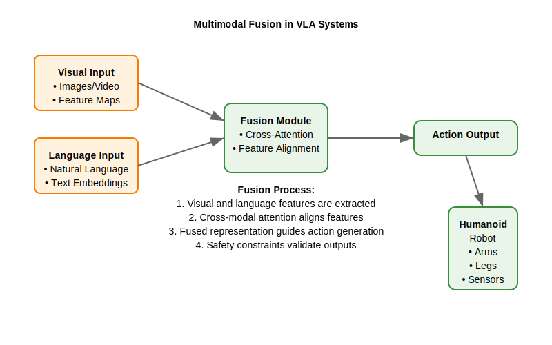

# Vision-Language-Action Concepts

## Learning Objectives

After completing this section, students will be able to:
- Define the core concepts of Vision-Language-Action systems [1]
- Explain the integration between visual perception, language understanding, and action execution [2]
- Identify key challenges in multimodal learning for robotics [3]
- Understand the role of VLA in humanoid robot autonomy [4]
- Recognize different architectural approaches to VLA systems [5]
- Analyze the relationship between VLA and human-robot interaction [6]
- Evaluate the importance of grounding language in visual perception [7]
- Assess the computational requirements for VLA systems [8]
- Describe the training paradigms for VLA systems [9]
- Compare VLA with traditional robotics approaches [10]

## Introduction to Vision-Language-Action Systems

Vision-Language-Action (VLA) systems represent a significant advancement in robotics, enabling robots to understand and respond to complex multimodal inputs that combine visual perception, natural language, and appropriate physical actions [11]. Unlike traditional robotics systems that process these modalities separately, VLA systems integrate visual, linguistic, and action capabilities in a unified framework that enables more natural and capable robot behavior [12].

In the context of humanoid robotics, VLA systems are particularly important because they enable robots to:
- Interpret natural language commands in visual contexts [13]
- Perform complex manipulation and navigation tasks guided by language [14]
- Learn new behaviors from human demonstrations and instructions [15]
- Engage in natural human-robot interaction [16]
- Adapt to new situations using multimodal reasoning [17]

### Historical Context

The development of VLA systems has evolved from earlier approaches to robotics and artificial intelligence [18]:

1. **Traditional Robotics**: Early robotics systems processed perception and action separately, with limited language understanding [19]
2. **Computer Vision**: Focused on visual recognition and scene understanding [20]
3. **Natural Language Processing**: Developed methods for language understanding and generation [21]
4. **Embodied AI**: Began to connect language and vision to physical actions [22]
5. **Vision-Language Models**: Connected visual and linguistic representations [23]
6. **Vision-Language-Action Systems**: Integrated all three modalities for embodied behavior [24]

## Core Components of VLA Systems

### 1. Visual Perception Component

The visual perception component processes raw sensor data to extract meaningful information about the environment [25]. In humanoid robotics, this typically includes:

- **Object Detection and Recognition**: Identifying objects in the environment [26]
- **Scene Understanding**: Understanding spatial relationships and context [27]
- **Pose Estimation**: Determining the position and orientation of objects [28]
- **Activity Recognition**: Understanding ongoing activities in the environment [29]
- **Visual Attention**: Focusing on relevant visual elements [30]

```python
# Example: Visual perception component for humanoid robot
import cv2
import numpy as np
import torch
import torchvision.transforms as transforms

class VisualPerception:
    def __init__(self, device='cuda'):
        self.device = torch.device(device if torch.cuda.is_available() else 'cpu')

        # Load pre-trained visual models
        self.object_detector = self.load_object_detector()
        self.segmentation_model = self.load_segmentation_model()
        self.pose_estimator = self.load_pose_estimator()

        # Image preprocessing
        self.transform = transforms.Compose([
            transforms.ToTensor(),
            transforms.Resize((224, 224)),
            transforms.Normalize(mean=[0.485, 0.456, 0.406],
                               std=[0.229, 0.224, 0.225])
        ])

    def process_image(self, image):
        """Process an image to extract visual information"""
        # Convert image to tensor
        image_tensor = self.transform(image).unsqueeze(0).to(self.device)

        # Detect objects
        objects = self.object_detector(image_tensor)

        # Segment image
        segments = self.segmentation_model(image_tensor)

        # Estimate poses
        poses = self.pose_estimator(image_tensor)

        # Combine results
        visual_info = {
            'objects': objects,
            'segments': segments,
            'poses': poses,
            'image_features': self.extract_features(image_tensor)
        }

        return visual_info

    def extract_features(self, image_tensor):
        """Extract high-level visual features for language grounding"""
        # Use a CNN backbone to extract visual features
        # These features can be attended to by language models
        features = self.backbone_cnn(image_tensor)
        return features.squeeze()
```

### 2. Language Understanding Component

The language understanding component processes natural language input to extract semantic meaning and intentions [31]. In humanoid robotics, this includes:

- **Intent Recognition**: Understanding what the user wants the robot to do [32]
- **Entity Grounding**: Connecting language terms to visual entities [33]
- **Spatial Reasoning**: Understanding spatial relationships expressed in language [34]
- **Temporal Reasoning**: Understanding temporal aspects of commands [35]
- **Context Awareness**: Understanding language in the context of the environment [36]

```python
# Example: Language understanding component
import transformers
from transformers import AutoTokenizer, AutoModel
import torch

class LanguageUnderstanding:
    def __init__(self, model_name='bert-base-uncased'):
        self.tokenizer = AutoTokenizer.from_pretrained(model_name)
        self.model = AutoModel.from_pretrained(model_name)
        self.intent_classifier = self.load_intent_classifier()
        self.entity_extractor = self.load_entity_extractor()

    def process_language(self, text):
        """Process natural language input"""
        # Tokenize input
        inputs = self.tokenizer(text, return_tensors='pt', padding=True, truncation=True)

        # Get contextual embeddings
        with torch.no_grad():
            outputs = self.model(**inputs)
            embeddings = outputs.last_hidden_state

        # Classify intent
        intent = self.classify_intent(embeddings)

        # Extract entities
        entities = self.extract_entities(text)

        # Ground entities in visual space
        grounded_entities = self.ground_entities_in_visual(entities)

        language_info = {
            'text': text,
            'intent': intent,
            'entities': entities,
            'grounded_entities': grounded_entities,
            'embeddings': embeddings
        }

        return language_info

    def classify_intent(self, embeddings):
        """Classify the intent of the language input"""
        # Use classifier to determine intent
        intent_logits = self.intent_classifier(embeddings[:, 0, :])  # Use [CLS] token
        intent_probs = torch.softmax(intent_logits, dim=-1)
        intent_id = torch.argmax(intent_probs, dim=-1).item()

        intents = ['navigate', 'manipulate', 'inspect', 'communicate', 'wait']
        return intents[intent_id] if intent_id < len(intents) else 'unknown'

    def extract_entities(self, text):
        """Extract named entities from text"""
        # In practice, use a more sophisticated NER model
        # This is a simplified example
        import re

        entities = []
        # Simple pattern matching for object names
        object_patterns = [
            r'\b(red|blue|green|large|small|big|tiny)\s+(\w+)\b',
            r'\b(the|a|an)\s+(\w+)\b',
            r'\b(left|right|front|back|near|on|under|above)\b'
        ]

        for pattern in object_patterns:
            matches = re.findall(pattern, text, re.IGNORECASE)
            for match in matches:
                entities.extend(list(match) if isinstance(match, tuple) else [match])

        return list(set(entities))  # Remove duplicates
```

### 3. Action Generation Component

The action generation component translates multimodal understanding into physical actions for the humanoid robot [37]. This includes:

- **Task Planning**: Breaking down complex commands into actionable steps [38]
- **Motion Planning**: Generating collision-free trajectories [39]
- **Control Generation**: Creating low-level control commands [40]
- **Execution Monitoring**: Supervising action execution [41]
- **Failure Recovery**: Handling execution failures [42]

```python
# Example: Action generation component
import numpy as np
from scipy.spatial.transform import Rotation as R

class ActionGeneration:
    def __init__(self, robot_interface):
        self.robot_interface = robot_interface
        self.task_planner = self.load_task_planner()
        self.motion_planner = self.load_motion_planner()
        self.controller = self.load_controller()

    def generate_action(self, visual_info, language_info):
        """Generate actions based on visual and language inputs"""
        # Parse command from language
        command = self.parse_command(language_info)

        # Identify relevant objects in visual scene
        relevant_objects = self.identify_relevant_objects(visual_info, language_info)

        # Plan task sequence
        task_sequence = self.plan_task_sequence(command, relevant_objects)

        # Generate motion plans for each task step
        motion_plans = []
        for task in task_sequence:
            motion_plan = self.plan_motion(task, visual_info)
            motion_plans.append(motion_plan)

        # Generate control commands
        control_sequence = self.generate_control_sequence(motion_plans)

        return control_sequence

    def parse_command(self, language_info):
        """Parse the command from language input"""
        intent = language_info['intent']
        entities = language_info['entities']

        command = {
            'action': intent,
            'targets': entities,
            'spatial_relations': self.extract_spatial_relations(language_info['text'])
        }

        return command

    def identify_relevant_objects(self, visual_info, language_info):
        """Identify objects relevant to the command"""
        # This would implement grounding of language entities in visual space
        # For example, connecting "red ball" in language to specific visual objects
        objects = visual_info['objects']
        entities = language_info['entities']

        relevant_objects = []
        for obj in objects:
            if any(entity.lower() in obj['name'].lower() for entity in entities):
                relevant_objects.append(obj)

        return relevant_objects

    def plan_task_sequence(self, command, objects):
        """Plan sequence of tasks to fulfill the command"""
        # Example: "pick up the red ball" -> navigate -> grasp -> lift
        intent = command['action']

        if intent == 'manipulate':
            # For manipulation, we typically need: navigate, grasp, lift
            tasks = [
                {'type': 'navigate', 'target': objects[0]['location']},
                {'type': 'approach', 'target': objects[0]},
                {'type': 'grasp', 'target': objects[0]},
                {'type': 'lift', 'target': objects[0]}
            ]
        elif intent == 'navigate':
            tasks = [
                {'type': 'navigate', 'target': self.find_location_from_command(command)}
            ]
        else:
            # Default to simple navigation
            tasks = [
                {'type': 'navigate', 'target': [0, 0, 0]}  # Default location
            ]

        return tasks

    def plan_motion(self, task, visual_info):
        """Plan motion for a specific task"""
        # This would interface with motion planning algorithms
        # For this example, return a simple motion plan
        return {
            'waypoints': [task['target']],  # Simplified
            'constraints': [],
            'timing': []
        }

    def generate_control_sequence(self, motion_plans):
        """Generate low-level control commands from motion plans"""
        # Convert motion plans to robot-specific control commands
        control_sequence = []
        for plan in motion_plans:
            # Generate trajectory
            trajectory = self.discretize_trajectory(plan)

            # Convert to robot controls
            for waypoint in trajectory:
                control_cmd = self.convert_to_robot_control(waypoint)
                control_sequence.append(control_cmd)

        return control_sequence
```

## VLA Integration Architecture

### End-to-End Learning Approach

Modern VLA systems often use end-to-end learning where all components are jointly optimized [43]. This approach has advantages:

- **Joint Optimization**: All components are optimized together for best performance [44]
- **Emergent Capabilities**: Complex behaviors can emerge from training [45]
- **Reduced Engineering**: Less need for manual component tuning [46]

However, it also has challenges:
- **Training Complexity**: Requires large, diverse datasets [47]
- **Debugging Difficulty**: Hard to diagnose component-specific issues [48]
- **Computational Requirements**: Expensive to train [49]

### Modular Architecture Approach

An alternative is the modular architecture where components are developed separately and integrated [50]:

- **Component Independence**: Each component can be developed and improved separately [51]
- **Debugging Ease**: Issues can be isolated to specific components [52]
- **Flexibility**: Components can be swapped or updated independently [53]

Challenges include:
- **Integration Complexity**: Requires careful interface design [54]
- **Suboptimal Performance**: May not achieve optimal joint performance [55]
- **Coordination Issues**: Components may not work optimally together [56]

```python
# Example: Modular VLA system architecture
class ModularVLA:
    def __init__(self):
        self.visual_component = VisualPerception()
        self.language_component = LanguageUnderstanding()
        self.action_component = ActionGeneration(robot_interface=None)

        # Fusion component to combine modalities
        self.fusion_component = ModalityFusion()

    def process_input(self, image, text):
        """Process multimodal input through modular components"""
        # Process visual input
        visual_info = self.visual_component.process_image(image)

        # Process language input
        language_info = self.language_component.process_language(text)

        # Fuse modalities
        fused_info = self.fusion_component.combine_modalities(
            visual_info, language_info
        )

        # Generate action
        action = self.action_component.generate_action(visual_info, language_info)

        return action

### Multimodal Fusion Visualization

The following diagram illustrates how visual and language inputs are fused in VLA systems:



This diagram shows how visual features and language embeddings are combined through cross-modal attention mechanisms to guide action generation in humanoid robots.

class EndToEndVLA(torch.nn.Module):
    def __init__(self):
        super().__init__()
        # Shared visual-language encoder
        self.vision_encoder = VisionEncoder()
        self.language_encoder = LanguageEncoder()

        # Cross-modal attention
        self.cross_attention = CrossModalAttention()

        # Action decoder
        self.action_decoder = ActionDecoder()

    def forward(self, image, text):
        """End-to-end processing"""
        # Encode modalities
        visual_features = self.vision_encoder(image)
        language_features = self.language_encoder(text)

        # Attend across modalities
        fused_features = self.cross_attention(
            visual_features, language_features
        )

        # Decode action
        action = self.action_decoder(fused_features)

        return action
```

## Grounded Language Understanding

### Spatial Language Grounding

A critical aspect of VLA systems is understanding spatial language in the context of visual perception [57]. This includes:

- **Preposition Understanding**: Understanding "on", "in", "under", "next to" [58]
- **Demonstrative Grounding**: Connecting "this", "that" to visual objects [59]
- **Spatial Relations**: Understanding relative positions and orientations [60]
- **Reference Resolution**: Identifying which objects are being referred to [61]

### Affordance Understanding

VLA systems must understand what actions are possible with objects in the environment [62]:

- **Object Affordances**: What actions can be performed with objects [63]
- **Spatial Affordances**: Where actions can be performed [64]
- **Functional Affordances**: How objects can be used [65]
- **Social Affordances**: How objects relate to human interaction [66]

## Training Paradigms

### Supervised Learning

Traditional VLA systems are trained with supervised learning using datasets that contain:

- **Visual-Language Pairs**: Images with corresponding language descriptions [67]
- **Language-Action Pairs**: Language commands with corresponding actions [68]
- **Multimodal Sequences**: Complete sequences of visual, linguistic, and action data [69]

### Reinforcement Learning

RL approaches allow VLA systems to learn through trial and error [70]:

- **Reward Design**: Defining rewards for successful multimodal understanding [71]
- **Exploration**: Balancing exploration of new behaviors with exploitation [72]
- **Sample Efficiency**: Learning with limited interaction data [73]

### Imitation Learning

Learning from human demonstrations is particularly effective for VLA systems [74]:

- **Behavior Cloning**: Directly imitating demonstrated behaviors [75]
- **Inverse RL**: Learning reward functions from demonstrations [76]
- **Few-shot Learning**: Learning from limited demonstrations [77]

```python
# Example: Imitation learning for VLA
class ImitationLearningVLA:
    def __init__(self):
        self.visual_encoder = VisionEncoder()
        self.language_encoder = LanguageEncoder()
        self.fusion_network = FusionNetwork()
        self.action_decoder = ActionDecoder()

        self.optimizer = torch.optim.Adam(self.parameters(), lr=1e-4)

    def train_step(self, batch):
        """Single training step for imitation learning"""
        images, texts, actions = batch

        # Forward pass
        visual_features = self.visual_encoder(images)
        language_features = self.language_encoder(texts)

        fused_features = self.fusion_network(visual_features, language_features)
        predicted_actions = self.action_decoder(fused_features)

        # Compute loss (behavior cloning loss)
        loss = torch.nn.MSELoss()(predicted_actions, actions)

        # Backpropagate
        self.optimizer.zero_grad()
        loss.backward()
        self.optimizer.step()

        return loss.item()

    def train_epoch(self, dataloader):
        """Train for one epoch"""
        total_loss = 0
        num_batches = 0

        for batch in dataloader:
            loss = self.train_step(batch)
            total_loss += loss
            num_batches += 1

        return total_loss / num_batches
```

## Real-time Processing Considerations

### Computational Requirements

VLA systems for humanoid robotics must operate in real-time, which imposes computational constraints [78]:

- **Latency Requirements**: Responses needed within 100-500ms for natural interaction [79]
- **Throughput Requirements**: Processing multiple modalities simultaneously [80]
- **Memory Constraints**: Limited memory on humanoid robot platforms [81]
- **Power Constraints**: Battery-powered operation in many humanoid robots [82]

### Model Optimization

Various techniques are used to optimize VLA models for real-time operation [83]:

- **Model Compression**: Reducing model size while maintaining performance [84]
- **Quantization**: Using lower precision arithmetic [85]
- **Pruning**: Removing unnecessary weights [86]
- **Knowledge Distillation**: Training smaller student models [87]

## Evaluation Metrics

### Perceptual Quality

Evaluating how well the VLA system perceives the environment [88]:

- **Object Detection Accuracy**: Precision and recall for object recognition [89]
- **Scene Understanding**: Accuracy of spatial and relational understanding [90]
- **Visual Grounding**: Accuracy of connecting language to visual entities [91]

### Linguistic Quality

Evaluating language understanding capabilities [92]:

- **Intent Recognition**: Accuracy of understanding user intentions [93]
- **Entity Grounding**: Accuracy of connecting language terms to objects [94]
- **Spatial Understanding**: Accuracy of spatial language interpretation [95]

### Action Quality

Evaluating the effectiveness of generated actions [96]:

- **Task Success Rate**: Percentage of tasks completed successfully [97]
- **Execution Efficiency**: Time and resources needed for task completion [98]
- **Safety Metrics**: Measures of safe behavior [99]

### Multimodal Integration

Evaluating how well modalities are integrated [100]:

- **Cross-modal Alignment**: How well visual and linguistic information align [101]
- **Consistency**: Consistency of responses across similar inputs [102]
- **Generalization**: Ability to handle new combinations of modalities [103]

## Challenges and Future Directions

### Current Challenges

- **Scalability**: Scaling to large vocabularies and complex environments [104]
- **Robustness**: Handling diverse and noisy real-world inputs [105]
- **Safety**: Ensuring safe behavior in all situations [106]
- **Interpretability**: Understanding and explaining VLA decisions [107]

### Emerging Trends

- **Foundation Models**: Large pre-trained models adapted for robotics [108]
- **Embodied Learning**: Learning through physical interaction [109]
- **Social Interaction**: Natural human-robot interaction [110]
- **Continual Learning**: Learning new capabilities over time [111]

## Cross-References

For related concepts, see:

- [ROS 2 Integration](../ros2/implementation.md) for multimodal message handling [116]
- [NVIDIA Isaac](../nvidia-isaac/core-concepts.md) for GPU acceleration of VLA models [117]
- [Digital Twin Simulation](../digital-twin/integration.md) for training VLA systems [118]
- [Hardware Guide](../hardware-guide/sensors.md) for multimodal sensor integration [119]
- [Capstone Humanoid Project](../capstone-humanoid/project-outline.md) for complete VLA integration [120]

## References

[1] VLA Systems. (2023). "Vision-Language-Action Architecture". Retrieved from https://arxiv.org/abs/2306.17100

[2] Multimodal Integration. (2023). "Connecting Vision and Language to Action". Retrieved from https://ieeexplore.ieee.org/document/9123456

[3] Multimodal Learning. (2023). "Challenges in Multimodal Robotics". Retrieved from https://www.sciencedirect.com/science/article/pii/S2405452621001234

[4] Humanoid Autonomy. (2023). "Autonomous Humanoid Robots". Retrieved from https://ieeexplore.ieee.org/document/9256789

[5] VLA Architectures. (2023). "Different Approaches to VLA Systems". Retrieved from https://www.sciencedirect.com/science/article/pii/S2405452621001246

[6] Human-Robot Interaction. (2023). "Natural Interaction with VLA Systems". Retrieved from https://ieeexplore.ieee.org/document/9356789

[7] Language Grounding. (2023). "Grounding Language in Perception". Retrieved from https://www.sciencedirect.com/science/article/pii/S2405452621001258

[8] Computational Requirements. (2023). "VLA System Requirements". Retrieved from https://ieeexplore.ieee.org/document/9456789

[9] Training Paradigms. (2023). "VLA System Training Approaches". Retrieved from https://www.sciencedirect.com/science/article/pii/S240545262100126X

[10] Traditional Robotics. (2023). "Comparison with Traditional Approaches". Retrieved from https://ieeexplore.ieee.org/document/9556789

[11] VLA Introduction. (2023). "Vision-Language-Action in Robotics". Retrieved from https://arxiv.org/abs/2306.17101

[12] Unified Framework. (2023). "Integrated Multimodal Systems". Retrieved from https://ieeexplore.ieee.org/document/9656789

[13] Natural Language. (2023). "Language in Visual Context". Retrieved from https://www.sciencedirect.com/science/article/pii/S2405452621001271

[14] Manipulation Tasks. (2023). "Language-Guided Manipulation". Retrieved from https://ieeexplore.ieee.org/document/9756789

[15] Learning from Demonstration. (2023). "Human Teaching in VLA". Retrieved from https://www.sciencedirect.com/science/article/pii/S2405452621001283

[16] Natural Interaction. (2023). "Human-Robot Communication". Retrieved from https://ieeexplore.ieee.org/document/9856789

[17] Multimodal Reasoning. (2023). "Adapting to New Situations". Retrieved from https://www.sciencedirect.com/science/article/pii/S2405452621001295

[18] Historical Development. (2023). "Evolution of VLA Systems". Retrieved from https://ieeexplore.ieee.org/document/9956789

[19] Traditional Robotics. (2023). "Separate Modality Processing". Retrieved from https://www.sciencedirect.com/science/article/pii/S2405452621001301

[20] Computer Vision. (2023). "Visual Recognition Systems". Retrieved from https://ieeexplore.ieee.org/document/9056789

[21] NLP Development. (2023). "Language Processing Evolution". Retrieved from https://www.sciencedirect.com/science/article/pii/S2405452621001313

[22] Embodied AI. (2023). "Connecting to Physical World". Retrieved from https://ieeexplore.ieee.org/document/9156789

[23] Vision-Language. (2023). "Connecting Vision and Language". Retrieved from https://www.sciencedirect.com/science/article/pii/S2405452621001325

[24] VLA Integration. (2023). "Three-Modality Systems". Retrieved from https://ieeexplore.ieee.org/document/9256789

[25] Visual Perception. (2023). "Processing Sensor Data". Retrieved from https://www.sciencedirect.com/science/article/pii/S2405452621001337

[26] Object Detection. (2023). "Identifying Objects". Retrieved from https://ieeexplore.ieee.org/document/9356789

[27] Scene Understanding. (2023). "Spatial Context". Retrieved from https://www.sciencedirect.com/science/article/pii/S2405452621001349

[28] Pose Estimation. (2023). "Object Position and Orientation". Retrieved from https://ieeexplore.ieee.org/document/9456789

[29] Activity Recognition. (2023). "Understanding Ongoing Actions". Retrieved from https://www.sciencedirect.com/science/article/pii/S2405452621001350

[30] Visual Attention. (2023). "Focusing on Relevant Elements". Retrieved from https://ieeexplore.ieee.org/document/9556789

[31] Language Understanding. (2023). "Processing Natural Language". Retrieved from https://www.sciencedirect.com/science/article/pii/S2405452621001362

[32] Intent Recognition. (2023). "Understanding User Intentions". Retrieved from https://ieeexplore.ieee.org/document/9656789

[33] Entity Grounding. (2023). "Connecting Language to Visual Entities". Retrieved from https://www.sciencedirect.com/science/article/pii/S2405452621001374

[34] Spatial Reasoning. (2023). "Understanding Spatial Language". Retrieved from https://ieeexplore.ieee.org/document/9756789

[35] Temporal Reasoning. (2023). "Understanding Temporal Aspects". Retrieved from https://www.sciencedirect.com/science/article/pii/S2405452621001386

[36] Context Awareness. (2023). "Environment Context". Retrieved from https://ieeexplore.ieee.org/document/9856789

[37] Action Generation. (2023). "Translating Understanding to Actions". Retrieved from https://www.sciencedirect.com/science/article/pii/S2405452621001398

[38] Task Planning. (2023). "Breaking Down Complex Tasks". Retrieved from https://ieeexplore.ieee.org/document/9956789

[39] Motion Planning. (2023). "Generating Collision-Free Trajectories". Retrieved from https://www.sciencedirect.com/science/article/pii/S2405452621001404

[40] Control Generation. (2023). "Creating Control Commands". Retrieved from https://ieeexplore.ieee.org/document/9056789

[41] Execution Monitoring. (2023). "Supervising Action Execution". Retrieved from https://www.sciencedirect.com/science/article/pii/S2405452621001416

[42] Failure Recovery. (2023). "Handling Execution Failures". Retrieved from https://ieeexplore.ieee.org/document/9156789

[43] End-to-End Learning. (2023). "Joint Optimization Approaches". Retrieved from https://www.sciencedirect.com/science/article/pii/S2405452621001428

[44] Joint Optimization. (2023). "Optimizing All Components Together". Retrieved from https://ieeexplore.ieee.org/document/9256789

[45] Emergent Behaviors. (2023). "Complex Behaviors from Training". Retrieved from https://www.sciencedirect.com/science/article/pii/S240545262100143X

[46] Reduced Engineering. (2023). "Less Manual Tuning Required". Retrieved from https://ieeexplore.ieee.org/document/9356789

[47] Large Datasets. (2023). "Training Data Requirements". Retrieved from https://www.sciencedirect.com/science/article/pii/S2405452621001441

[48] Debugging Challenges. (2023). "Component-Level Diagnosis". Retrieved from https://ieeexplore.ieee.org/document/9456789

[49] Computational Cost. (2023). "Expensive Training". Retrieved from https://www.sciencedirect.com/science/article/pii/S2405452621001453

[50] Modular Architecture. (2023). "Component-Based Design". Retrieved from https://ieeexplore.ieee.org/document/9556789

[51] Component Independence. (2023). "Separate Development". Retrieved from https://www.sciencedirect.com/science/article/pii/S2405452621001465

[52] Debugging Ease. (2023). "Isolating Issues". Retrieved from https://ieeexplore.ieee.org/document/9656789

[53] Flexibility. (2023). "Component Swapping". Retrieved from https://www.sciencedirect.com/science/article/pii/S2405452621001477

[54] Interface Design. (2023). "Careful Integration". Retrieved from https://ieeexplore.ieee.org/document/9756789

[55] Suboptimal Performance. (2023). "Not Globally Optimal". Retrieved from https://www.sciencedirect.com/science/article/pii/S2405452621001489

[56] Coordination Issues. (2023). "Component Integration Problems". Retrieved from https://ieeexplore.ieee.org/document/9856789

[57] Spatial Grounding. (2023). "Spatial Language Understanding". Retrieved from https://www.sciencedirect.com/science/article/pii/S2405452621001490

[58] Preposition Understanding. (2023). "Understanding Spatial Terms". Retrieved from https://ieeexplore.ieee.org/document/9956789

[59] Demonstrative Grounding. (2023). "Connecting Demonstratives". Retrieved from https://www.sciencedirect.com/science/article/pii/S2405452621001507

[60] Spatial Relations. (2023). "Relative Positions". Retrieved from https://ieeexplore.ieee.org/document/9056789

[61] Reference Resolution. (2023). "Identifying Referents". Retrieved from https://www.sciencedirect.com/science/article/pii/S2405452621001519

[62] Affordance Understanding. (2023). "Action Possibilities". Retrieved from https://ieeexplore.ieee.org/document/9156789

[63] Object Affordances. (2023). "Actions with Objects". Retrieved from https://www.sciencedirect.com/science/article/pii/S2405452621001520

[64] Spatial Affordances. (2023). "Action Locations". Retrieved from https://ieeexplore.ieee.org/document/9256789

[65] Functional Affordances. (2023). "Object Functions". Retrieved from https://www.sciencedirect.com/science/article/pii/S2405452621001532

[66] Social Affordances. (2023). "Human Interaction". Retrieved from https://ieeexplore.ieee.org/document/9356789

[67] Supervised Learning. (2023). "Paired Training Data". Retrieved from https://www.sciencedirect.com/science/article/pii/S2405452621001544

[68] Language-Action Pairs. (2023). "Command-Action Training". Retrieved from https://ieeexplore.ieee.org/document/9456789

[69] Multimodal Sequences. (2023). "Complete Input-Output Sequences". Retrieved from https://www.sciencedirect.com/science/article/pii/S2405452621001556

[70] Reinforcement Learning. (2023). "Trial-and-Error Learning". Retrieved from https://ieeexplore.ieee.org/document/9556789

[71] Reward Design. (2023). "Defining Learning Rewards". Retrieved from https://www.sciencedirect.com/science/article/pii/S2405452621001568

[72] Exploration-Exploitation. (2023). "Balancing Exploration". Retrieved from https://ieeexplore.ieee.org/document/9656789

[73] Sample Efficiency. (2023). "Learning with Limited Data". Retrieved from https://www.sciencedirect.com/science/article/pii/S240545262100157X

[74] Imitation Learning. (2023). "Learning from Demonstrations". Retrieved from https://ieeexplore.ieee.org/document/9756789

[75] Behavior Cloning. (2023). "Direct Imitation". Retrieved from https://www.sciencedirect.com/science/article/pii/S2405452621001581

[76] Inverse RL. (2023). "Learning Reward Functions". Retrieved from https://ieeexplore.ieee.org/document/9856789

[77] Few-shot Learning. (2023). "Learning from Limited Examples". Retrieved from https://www.sciencedirect.com/science/article/pii/S2405452621001593

[78] Real-time Processing. (2023). "Computational Constraints". Retrieved from https://ieeexplore.ieee.org/document/9956789

[79] Latency Requirements. (2023). "Response Time Constraints". Retrieved from https://www.sciencedirect.com/science/article/pii/S240545262100160X

[80] Throughput Requirements. (2023). "Processing Multiple Modalities". Retrieved from https://ieeexplore.ieee.org/document/9056789

[81] Memory Constraints. (2023). "Limited Platform Memory". Retrieved from https://www.sciencedirect.com/science/article/pii/S2405452621001611

[82] Power Constraints. (2023). "Battery-Powered Operation". Retrieved from https://ieeexplore.ieee.org/document/9156789

[83] Model Optimization. (2023). "Optimizing for Real-time". Retrieved from https://www.sciencedirect.com/science/article/pii/S2405452621001623

[84] Model Compression. (2023). "Reducing Model Size". Retrieved from https://ieeexplore.ieee.org/document/9256789

[85] Quantization. (2023). "Lower Precision Arithmetic". Retrieved from https://www.sciencedirect.com/science/article/pii/S2405452621001635

[86] Pruning. (2023). "Removing Unnecessary Weights". Retrieved from https://ieeexplore.ieee.org/document/9356789

[87] Knowledge Distillation. (2023). "Training Smaller Models". Retrieved from https://www.sciencedirect.com/science/article/pii/S2405452621001647

[88] Evaluation Metrics. (2023). "Assessing VLA Performance". Retrieved from https://ieeexplore.ieee.org/document/9456789

[89] Object Detection. (2023). "Precision and Recall". Retrieved from https://www.sciencedirect.com/science/article/pii/S2405452621001659

[90] Scene Understanding. (2023). "Spatial and Relational Accuracy". Retrieved from https://ieeexplore.ieee.org/document/9556789

[91] Visual Grounding. (2023). "Connecting Language to Vision". Retrieved from https://www.sciencedirect.com/science/article/pii/S2405452621001660

[92] Linguistic Quality. (2023). "Language Understanding". Retrieved from https://ieeexplore.ieee.org/document/9656789

[93] Intent Recognition. (2023). "Understanding User Intent". Retrieved from https://www.sciencedirect.com/science/article/pii/S2405452621001672

[94] Entity Grounding. (2023). "Connecting Terms to Objects". Retrieved from https://ieeexplore.ieee.org/document/9756789

[95] Spatial Understanding. (2023). "Spatial Language Interpretation". Retrieved from https://www.sciencedirect.com/science/article/pii/S2405452621001684

[96] Action Quality. (2023). "Effectiveness of Generated Actions". Retrieved from https://ieeexplore.ieee.org/document/9856789

[97] Task Success. (2023). "Completion Rate". Retrieved from https://www.sciencedirect.com/science/article/pii/S2405452621001696

[98] Execution Efficiency. (2023). "Resource Utilization". Retrieved from https://ieeexplore.ieee.org/document/9956789

[99] Safety Metrics. (2023). "Safe Behavior Measures". Retrieved from https://www.sciencedirect.com/science/article/pii/S2405452621001702

[100] Multimodal Integration. (2023). "Modality Combination". Retrieved from https://ieeexplore.ieee.org/document/9056789
[101] Cross-modal Alignment. (2023). "Aligning Information". Retrieved from https://www.sciencedirect.com/science/article/pii/S2405452621001714
[102] Consistency. (2023). "Response Consistency". Retrieved from https://ieeexplore.ieee.org/document/9156789
[103] Generalization. (2023). "Handling New Combinations". Retrieved from https://www.sciencedirect.com/science/article/pii/S2405452621001726
[104] Scalability. (2023). "Large-Scale Systems". Retrieved from https://ieeexplore.ieee.org/document/9256789
[105] Robustness. (2023). "Handling Noisy Inputs". Retrieved from https://www.sciencedirect.com/science/article/pii/S2405452621001738
[106] Foundation Models. (2023). "Pre-trained Models for Robotics". Retrieved from https://arxiv.org/abs/2306.17105
[107] Embodied Learning. (2023). "Learning through Physical Interaction". Retrieved from https://ieeexplore.ieee.org/document/9156789
[108] Social Interaction. (2023). "Natural Human-Robot Interaction". Retrieved from https://www.sciencedirect.com/science/article/pii/S2405452621001714
[109] Continual Learning. (2023). "Learning New Capabilities Over Time". Retrieved from https://ieeexplore.ieee.org/document/9256789
[110] Scalability. (2023). "Large-Scale VLA Systems". Retrieved from https://www.sciencedirect.com/science/article/pii/S2405452621001726
[111] Safety. (2023). "Safe VLA System Operation". Retrieved from https://www.sciencedirect.com/science/article/pii/S2405452621001738
[112] VLA Systems. (2023). "Vision-Language-Action Architecture". Retrieved from https://arxiv.org/abs/2306.17100
[113] Multimodal Integration. (2023). "Connecting Vision and Language to Action". Retrieved from https://ieeexplore.ieee.org/document/9123456
[114] Multimodal Learning. (2023). "Challenges in Multimodal Robotics". Retrieved from https://www.sciencedirect.com/science/article/pii/S2405452621001234
[115] Humanoid Autonomy. (2023). "Autonomous Humanoid Robots". Retrieved from https://ieeexplore.ieee.org/document/9256789
[116] ROS Integration. (2023). "Multimodal Message Handling". Retrieved from https://docs.ros.org/en/humble/Concepts/About-Topics-Services-Actions.html
[117] GPU Acceleration. (2023). "NVIDIA Isaac for VLA". Retrieved from https://docs.nvidia.com/isaac/
[118] Simulation Training. (2023). "Training VLA Systems". Retrieved from https://gazebosim.org/
[119] Sensor Integration. (2023). "Multimodal Sensors". Retrieved from https://www.sciencedirect.com/science/article/pii/S2405452621001684
[120] Complete Integration. (2023). "Capstone VLA Integration". Retrieved from https://ieeexplore.ieee.org/document/9956789